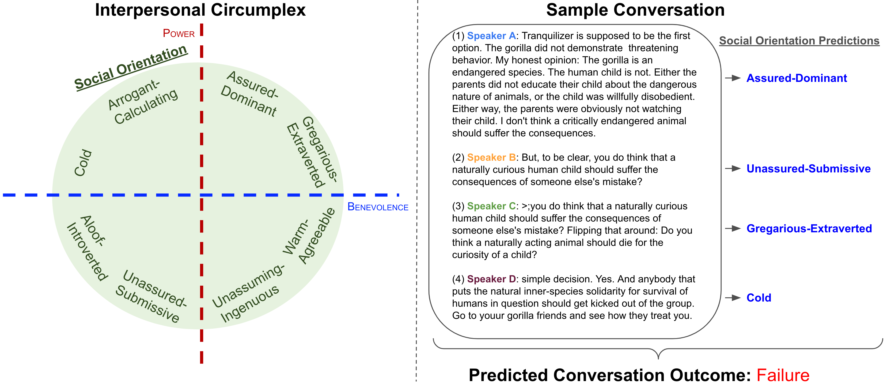

# Social Orientation: A New Feature for Dialogue Analysis
This repository implements the experiments presented in the paper, Social Orientation: A New Feature for Dialogue Analysis, which was accepted to LREC-COLING 2024.

**Authors:** Todd Morrill, Zhaoyuan Deng, Yanda Chen, Amith Ananthram, Colin Wayne Leach, Kathleen McKeown

**arXiv link:** [https://arxiv.org/abs/2403.04770](https://arxiv.org/abs/2403.04770)

**TLDR;** There are many settings where it is useful to predict and explain the success or failure of a dialogue. Circumplex theory from psychology models the social orientations (e.g., Warm-Agreeable, Arrogant-Calculating) of conversation participants, which can in turn can be used to predict and explain the outcome of social interactions, such as in online debates over Wikipedia page edits or on the Reddit ChangeMyView forum.

[](https://arxiv.org/abs/2403.04770)

## Published Models & Datasets
- [Social Orientation Dataset](https://huggingface.co/datasets/tee-oh-double-dee/social-orientation) - A dataset of social orientation labels for the Conversations Gone Awry (CGA) dataset collected using OpenAI GPT-4. See `examples/evaluate.py` for how to merge these labels with the CGA dataset.
- [Social Orientation Model](https://huggingface.co/tee-oh-double-dee/social-orientation) - A DistilBERT model trained on the CGA dataset with social orientation labels collected using GPT-4. This model can be used to predict social orientation labels for new conversations. See `examples/single_prediction.py` or `examples/predict.py` for how to use this model.
- [Social Orientation Model (XLM-R)](https://huggingface.co/tee-oh-double-dee/social-orientation-multilingual) - An XLM-R model trained on the CGA dataset with social orientation labels collected using GPT-4. This model can be used to predict social orientation labels for new conversations in up to 100 languages. The usage is the same as the DistilBERT model.
- Chinese language Wikipedia outcome dataset - A dataset of Wikipedia page edits in Chinese language Wikipedia with success/failure outcome labels. This dataset is used to evaluate the performance of the social orientation tags in a second language beyond English. Coming soon.

## Social Orientation Model Usage
You can make social orientation predictions for dialog utterances as show below.
```python
import pprint

from transformers import AutoModelForSequenceClassification, AutoTokenizer

sample_input = 'Speaker 1: This is really terrific work!'
model = AutoModelForSequenceClassification.from_pretrained(
        'tee-oh-double-dee/social-orientation')
model.eval()
tokenizer = AutoTokenizer.from_pretrained(
    'tee-oh-double-dee/social-orientation')
model_input = tokenizer(sample_input, return_tensors='pt')
output = model(**model_input)
output_probs = output.logits.softmax(dim=1)
id2label = model.config.id2label
pred_dict = {
    id2label[i]: output_probs[0][i].item()
    for i in range(len(id2label))
}
pprint.pprint(pred_dict)
```
---
# Experiment Reproduction Instructions
## Environment setup
With a virtual environment:
```bash
python -m venv .venv
source .venv/bin/activate
pip install -r requirements.txt
```
With Conda:
```bash
conda create -n soc-orientation python=3.12 -y
conda activate soc-orientation
pip install -r requirements.txt
```

## Collect social orientation tags from GPT (not required - code provided for reference)
The following command will generate prompts to collect social orientation tags for the [Conversations Gone Awry (CGA)](https://convokit.cornell.edu/documentation/awry.html) dataset using OpenAI GPT models. Prompts can must be generated for the training, validation, and test set CGA conversations. Many conversations will fit within the token limit for GPT-4 (as of 06/2023), though some conversations are chunked into multiple API calls, which we denote as train-long, val-long, and test-long.
```bash
python gpt_prompts.py \
    --gpt-mode train \
    --gpt-model gpt-4 \
    --gpt-data-dir data/gpt-4-input \
    --calculate-cost
```
Next, we send data to the GPT API using `api_request_parallel_processor.py`. See the module docstring for usage details. Again, we need to run this for all splits of the data in {train, val, test, train-long, val-long, test-long}.
```bash
python api_request_parallel_processor.py \
    --requests_filepath data/gpt-4-input/train-long.jsonl \
    --save_filepath data/gpt-4-output/train-long_results_gpt4.jsonl \
    --request_url https://api.openai.com/v1/chat/completions \
    --max_requests_per_minute 175 \
    --max_tokens_per_minute 35000 \
    --model gpt-4-0314 \
    --temperature 0.4 \
    --top_p 1.0 \
    --token_encoding_name gpt-4-0314 \
    --max_attempts 10 \
    --logging_level 20 \
```

## Parse GPT API responses (required)
Finally, we parse the GPT-4 API response using `parse.py`, where we specify which GPT response files to parse. This outputs CSV files, where each row is a social orientation label for an utterance in a specific conversation.
```bash
python parse.py \
    --gpt-outputs-filepath \
        data/gpt-4-output/train_results_gpt4.jsonl \
        data/gpt-4-output/train-long_results_gpt4.jsonl \
        data/gpt-4-output/val_results_gpt4.jsonl \
        data/gpt-4-output/val-long_results_gpt4.jsonl \
        data/gpt-4-output/test_results_gpt4.jsonl \
        data/gpt-4-output/test-long_results_gpt4.jsonl \
    --parse-output-dir \
        data/gpt-4-cga-social-orientation-labels
```

## Train a social orientation tagger using GPT-4 labels
Train and predict social orientation tags on the CGA dataset using GPT-4 labels:
```bash
CUDA_VISIBLE_DEVICES=0 \
nohup \
python -m train \
    --dataset social-orientation \
    --model-name-or-path distilbert-base-uncased \
    --batch-size 32 \
    --lr 1e-6 \
    --val-steps 50 \
    --eval-test \
    --early-stopping-patience 10 \
    --include-speakers \
    --social-orientation-filepaths \
        data/gpt-4-cga-social-orientation-labels/train_results_gpt4_parsed.csv \
        data/gpt-4-cga-social-orientation-labels/val_results_gpt4_parsed.csv \
        data/gpt-4-cga-social-orientation-labels/train-long_results_gpt4_parsed.csv \
        data/gpt-4-cga-social-orientation-labels/val-long_results_gpt4_parsed.csv \
        data/gpt-4-cga-social-orientation-labels/test_results_gpt4_parsed.csv \
        data/gpt-4-cga-social-orientation-labels/test-long_results_gpt4_parsed.csv \
    --fp16 \
    --window-size 2 \
    --save-steps 50 \
    --num-checkpoints 2 \
    --model-dir model/distilbert-social-winsize-2 \
    --weighted-loss \
> logs/runs/distilbert-social-winsize-2.log 2>&1 &
```

<!-- Alternatively, train with the HuggingFace trainer:
```bash
CUDA_VISIBLE_DEVICES=0 \
nohup \
python -m train \
    --dataset social-orientation \
    --model-name-or-path distilbert-base-uncased \
    --batch-size 32 \
    --lr 1e-6 \
    --val-steps 50 \
    --eval-test \
    --early-stopping-patience 10 \
    --include-speakers \
    --social-orientation-filepaths \
        data/gpt-4-cga-social-orientation-labels/train_results_gpt4_parsed.csv \
        data/gpt-4-cga-social-orientation-labels/val_results_gpt4_parsed.csv \
        data/gpt-4-cga-social-orientation-labels/train-long_results_gpt4_parsed.csv \
        data/gpt-4-cga-social-orientation-labels/val-long_results_gpt4_parsed.csv \
        data/gpt-4-cga-social-orientation-labels/test_results_gpt4_parsed.csv \
        data/gpt-4-cga-social-orientation-labels/test-long_results_gpt4_parsed.csv \
    --fp16 \
    --window-size 2 \
    --save-steps 50 \
    --num-checkpoints 2 \
    --model-dir model/distilbert-social-winsize-2-hf \
    --weighted-loss \
    --trainer hf \
> logs/runs/distilbert-social-winsize-2-hf.log 2>&1 &
``` -->

Predict social orientation tags on the CGA dataset using the trained model. You can include the GPT-4 social orientation filepaths to evaluate the model. 
```bash
python predict.py \
    --model-dir model/distilbert-social-winsize-2 \
    --window-size 2 \
    --checkpoint best \
    --dataset social-orientation \
    --include-speakers \
    --social-orientation-filepaths \
        data/gpt-4-cga-social-orientation-labels/train_results_gpt4_parsed.csv \
        data/gpt-4-cga-social-orientation-labels/val_results_gpt4_parsed.csv \
        data/gpt-4-cga-social-orientation-labels/train-long_results_gpt4_parsed.csv \
        data/gpt-4-cga-social-orientation-labels/val-long_results_gpt4_parsed.csv \
        data/gpt-4-cga-social-orientation-labels/test_results_gpt4_parsed.csv \
        data/gpt-4-cga-social-orientation-labels/test-long_results_gpt4_parsed.csv \
    --prediction-dir data/predictions \
    --batch-size 256 \
    --disable-train-shuffle
```

## Run data ablation experiments, varying the dataset size
The following experiment trains CGA models as we vary the size of the training dataset. It also compares the inclusion and exclusion of social orientation tags, both predicted, and from GPT-4.
```bash
nohup \
python -m train \
    --dataset cga \
    --model-name-or-path distilbert-base-uncased \
    --batch-size 32 \
    --lr 5e-6 \
    --val-steps 50 \
    --early-stopping-patience 10 \
    --include-speakers \
    --include-social-orientation \
    --social-orientation-filepaths \
        data/gpt-4-cga-social-orientation-labels/train_results_gpt4_parsed.csv \
        data/gpt-4-cga-social-orientation-labels/val_results_gpt4_parsed.csv \
        data/gpt-4-cga-social-orientation-labels/train-long_results_gpt4_parsed.csv \
        data/gpt-4-cga-social-orientation-labels/val-long_results_gpt4_parsed.csv \
        data/gpt-4-cga-social-orientation-labels/test_results_gpt4_parsed.csv \
        data/gpt-4-cga-social-orientation-labels/test-long_results_gpt4_parsed.csv \
    --predicted-social-orientation-filepaths \
        data/predictions/social-orientation-social/distilbert-base-uncased/train_winsize_2_model_distilbert-base-uncased.csv \
        data/predictions/social-orientation-social/distilbert-base-uncased/val_winsize_2_model_distilbert-base-uncased.csv \
        data/predictions/social-orientation-social/distilbert-base-uncased/test_winsize_2_model_distilbert-base-uncased.csv \
    --fp16 \
    --add-tokens \
    --window-size all \
    --use-multiprocessing \
    --num-runs 5 \
    --experiment subset \
    --subset-pcts 0.01 0.1 0.2 0.5 1.0 \
    --use-cache \
    --seed 42 \
    --jobs-per-gpu 8 \
    --eval-test \
> logs/runs/subset-cga.log 2>&1 &
```

Run experiments with logistic regression model.
```bash
python classic.py \
    --dataset cga \
    --include-speakers \
    --social-orientation-filepaths \
        data/predictions/social-orientation-social/distilbert-base-uncased/train_winsize_2_model_distilbert-base-uncased.csv \
        data/predictions/social-orientation-social/distilbert-base-uncased/val_winsize_2_model_distilbert-base-uncased.csv \
        data/predictions/social-orientation-social/distilbert-base-uncased/test_winsize_2_model_distilbert-base-uncased.csv \
    --num-runs 5 \
    --subset-pcts 0.01 0.1 0.2 0.5 1.0 \
    --window-size all \
    --features social_counts distilbert tfidf sentiment \
    --use-cache \
    --analysis-dir logs/analysis \
    --experiment-dir logs/experiments
```

Plot results:
```bash
python analyze.py \
    --analysis-mode data-ablation \
    --experiment-filepath \
        logs/experiments/subset_cga_distilbert-base-uncased.csv \
        logs/experiments/subset_cga_logistic_clf.csv \
    --analysis-dir logs/analysis
```

Run t-test:
```bash
python analyze.py \
    --analysis-mode t-test \
    --experiment subset \
    --experiment-filepath \
        logs/experiments/subset_cga_distilbert-base-uncased.csv \
        logs/experiments/subset_cga_logistic_clf.csv
    --analysis-dir logs/analysis
```

## Run data ablation experiment for CGA CMV subset
First make social orientation predictions.
```bash
python predict.py \
    --model-dir model/distilbert-social-winsize-2 \
    --hf-cache-dir .hf-cache \
    --window-size 2 \
    --checkpoint best \
    --dataset cga-cmv \
    --data-dir data/convokit/conversations-gone-awry-cmv-corpus \
    --include-speakers \
    --prediction-dir data/predictions \
    --batch-size 256 \
    --return-utterances \
    --disable-train-shuffle \
    --dont-return-labels
```
Then train CGA CMV models with predicted social orientation tags, varying the subset size.
```bash
nohup \
python -m train \
    --dataset cga-cmv \
    --data-dir data/convokit/conversations-gone-awry-cmv-corpus \
    --model-name-or-path distilbert-base-uncased \
    --hf-cache-dir .hf-cache \
    --batch-size 32 \
    --lr 5e-6 \
    --val-steps 50 \
    --early-stopping-patience 10 \
    --include-speakers \
    --include-social-orientation \
    --social-orientation-filepaths \
        data/predictions/cga-cmv-social/distilbert-base-uncased/train_winsize_2_model_distilbert-base-uncased.csv \
        data/predictions/cga-cmv-social/distilbert-base-uncased/val_winsize_2_model_distilbert-base-uncased.csv \
        data/predictions/cga-cmv-social/distilbert-base-uncased/test_winsize_2_model_distilbert-base-uncased.csv \
    --fp16 \
    --add-tokens \
    --window-size all \
    --use-multiprocessing \
    --num-runs 5 \
    --experiment subset \
    --subset-pcts 0.01 0.1 0.2 0.5 1.0 \
    --use-cache \
    --jobs-per-gpu 8 \
    --eval-test \
> logs/runs/subset-cga-cmv.log 2>&1 &
```

Run experiments with logistic regression model.
```bash
python classic.py \
    --dataset cga-cmv \
    --data-dir data/convokit/conversations-gone-awry-cmv-corpus \
    --hf-cache-dir .hf-cache \
    --include-speakers \
    --social-orientation-filepaths \
        data/predictions/cga-cmv-social/distilbert-base-uncased/train_winsize_2_model_distilbert-base-uncased.csv \
        data/predictions/cga-cmv-social/distilbert-base-uncased/val_winsize_2_model_distilbert-base-uncased.csv \
        data/predictions/cga-cmv-social/distilbert-base-uncased/test_winsize_2_model_distilbert-base-uncased.csv \
    --num-runs 5 \
    --subset-pcts 0.01 0.1 0.2 0.5 1.0 \
    --window-size all \
    --features social_counts distilbert tfidf sentiment \
    --use-cache
```

Plot results:
```bash
python analyze.py \
    --analysis-mode data-ablation \
    --dataset cga-cmv \
    --experiment-filepath \
        logs/experiments/subset_cga-cmv_distilbert-base-uncased.csv \
        logs/experiments/subset_cga-cmv_logistic_clf.csv \
    --analysis-dir logs/analysis
```

Run t-test:
```bash
python analyze.py \
    --analysis-mode t-test \
    --experiment subset \
    --dataset cga-cmv \
    --data-dir data/convokit/conversations-gone-awry-cmv-corpus \
    --experiment-filepath \
        logs/experiments/subset_cga-cmv_distilbert-base-uncased.csv \
        logs/experiments/subset_cga-cmv_logistic_clf.csv \
    --analysis-dir logs/analysis
```

## Train a social orientation tagger using XLMR
```bash
CUDA_VISIBLE_DEVICES=4 nohup \
python -m train \
    --dataset social-orientation \
    --model-name-or-path xlm-roberta-base \
    --hf-cache-dir .hf-cache \
    --batch-size 32 \
    --lr 1e-6 \
    --val-steps 50 \
    --early-stopping-patience 10 \
    --include-speakers \
    --social-orientation-filepaths \
        data/gpt-4-cga-social-orientation-labels/train_results_gpt4_parsed.csv \
        data/gpt-4-cga-social-orientation-labels/val_results_gpt4_parsed.csv \
        data/gpt-4-cga-social-orientation-labels/train-long_results_gpt4_parsed.csv \
        data/gpt-4-cga-social-orientation-labels/val-long_results_gpt4_parsed.csv \
        data/gpt-4-cga-social-orientation-labels/test_results_gpt4_parsed.csv \
        data/gpt-4-cga-social-orientation-labels/test-long_results_gpt4_parsed.csv \
    --fp16 \
    --window-size 2 \
    --save-steps 50 \
    --num-checkpoints 2 \
    --model-dir model/xlmr-social-winsize-2 \
    --eval-test \
    --weighted-loss \
> logs/runs/xlmr-social-winsize-2.log 2>&1 &
```

<!-- ```bash
CUDA_VISIBLE_DEVICES=2 nohup \
python -m train \
    --dataset social-orientation \
    --model-name-or-path xlm-roberta-base \
    --hf-cache-dir .hf-cache \
    --batch-size 32 \
    --lr 1e-6 \
    --val-steps 50 \
    --early-stopping-patience 10 \
    --include-speakers \
    --social-orientation-filepaths \
        data/gpt-4-cga-social-orientation-labels/train_results_gpt4_parsed.csv \
        data/gpt-4-cga-social-orientation-labels/val_results_gpt4_parsed.csv \
        data/gpt-4-cga-social-orientation-labels/train-long_results_gpt4_parsed.csv \
        data/gpt-4-cga-social-orientation-labels/val-long_results_gpt4_parsed.csv \
        data/gpt-4-cga-social-orientation-labels/test_results_gpt4_parsed.csv \
        data/gpt-4-cga-social-orientation-labels/test-long_results_gpt4_parsed.csv \
    --fp16 \
    --window-size 2 \
    --save-steps 50 \
    --num-checkpoints 2 \
    --model-dir model/xlmr-social-winsize-2-hf \
    --trainer hf \
    --eval-test \
    --weighted-loss \
> logs/runs/xlmr-social-winsize-2-hf.log 2>&1 &
``` -->

## Explainability experiments
Train a single CGA CMV model with predicted social orientation tags
```bash
nohup \
python -u -m train \
    --dataset cga-cmv \
    --data-dir data/convokit/conversations-gone-awry-cmv-corpus \
    --model-name-or-path distilbert-base-uncased \
    --hf-cache-dir .hf-cache \
    --batch-size 32 \
    --lr 1e-6 \
    --val-steps 50 \
    --early-stopping-patience 5 \
    --include-speakers \
    --include-social-orientation \
    --social-orientation-filepaths \
        data/predictions/cga-cmv-social/distilbert-base-uncased/train_winsize_2_model_distilbert-base-uncased.csv \
        data/predictions/cga-cmv-social/distilbert-base-uncased/val_winsize_2_model_distilbert-base-uncased.csv \
        data/predictions/cga-cmv-social/distilbert-base-uncased/test_winsize_2_model_distilbert-base-uncased.csv \
    --fp16 \
    --add-tokens \
    --window-size all \
    --eval-test \
    --save-steps 50 \
    --num-checkpoints 2 \
    --model-dir model/distilbert-cga-cmv-distilbert-winsize-2 \
> logs/runs/distilbert-cga-cmv-distilbert-winsize-2.log 2>&1 &
```

Run explainability experiments
```bash
python explain.py \
    --model-dir model/distilbert-cga-cmv-distilbert-winsize-2 \
    --window-size all \
    --checkpoint best \
    --dataset cga-cmv \
    --data-dir data/convokit/conversations-gone-awry-cmv-corpus \
    --analysis-dir logs/analysis \
    --social-orientation-filepaths \
        data/predictions/cga-cmv-social/distilbert-base-uncased/train_winsize_2_model_distilbert-base-uncased.csv \
        data/predictions/cga-cmv-social/distilbert-base-uncased/val_winsize_2_model_distilbert-base-uncased.csv \
        data/predictions/cga-cmv-social/distilbert-base-uncased/test_winsize_2_model_distilbert-base-uncased.csv \
    --include-speakers \
    --include-social-orientation \
    --batch-size 256 \
    --add-tokens \
    --disable-train-shuffle \
    --disable-prepared-inputs
```

## Qualitative analysis
The following commands produce the qualitative analysis plots presented in the paper.

Plot the distribution of social orientation labels.
```bash
python analyze.py \
    --analysis-mode gpt-4-preds \
    --dataset cga \
    --social-orientation-filepaths \
        data/gpt-4-cga-social-orientation-labels/train_results_gpt4_parsed.csv \
        data/gpt-4-cga-social-orientation-labels/train-long_results_gpt4_parsed.csv \
        data/gpt-4-cga-social-orientation-labels/val_results_gpt4_parsed.csv \
        data/gpt-4-cga-social-orientation-labels/val-long_results_gpt4_parsed.csv \
        data/gpt-4-cga-social-orientation-labels/test_results_gpt4_parsed.csv \
        data/gpt-4-cga-social-orientation-labels/test-long_results_gpt4_parsed.csv \
    --analysis-dir logs/analysis
```

Confusion matrix of social orientation predictions vs. GPT-4 predictions
```bash
python analyze.py \
    --analysis-mode social-eval \
    --dataset cga \
    --social-orientation-filepaths \
        data/gpt-4-cga-social-orientation-labels/train_results_gpt4_parsed.csv \
        data/gpt-4-cga-social-orientation-labels/train-long_results_gpt4_parsed.csv \
        data/gpt-4-cga-social-orientation-labels/val_results_gpt4_parsed.csv \
        data/gpt-4-cga-social-orientation-labels/val-long_results_gpt4_parsed.csv \
        data/gpt-4-cga-social-orientation-labels/test_results_gpt4_parsed.csv \
        data/gpt-4-cga-social-orientation-labels/test-long_results_gpt4_parsed.csv \
    --predicted-social-orientation-filepaths \
        data/predictions/social-orientation-social/distilbert-base-uncased/train_winsize_2_model_distilbert-base-uncased.csv \
        data/predictions/social-orientation-social/distilbert-base-uncased/val_winsize_2_model_distilbert-base-uncased.csv \
        data/predictions/social-orientation-social/distilbert-base-uncased/test_winsize_2_model_distilbert-base-uncased.csv \
    --analysis-dir logs/analysis
```

Plot the conversation outcomes by social orientation labels and look at conversation outcomes by co-occurrence of social orientation labels.
```bash
python analyze.py \
    --analysis-mode outcome-analysis \
    --dataset cga-cmv \
    --data-dir data/convokit/conversations-gone-awry-cmv-corpus \
    --social-orientation-filepaths \
        data/predictions/cga-cmv-social/distilbert-base-uncased/train_winsize_2_model_distilbert-base-uncased.csv \
        data/predictions/cga-cmv-social/distilbert-base-uncased/val_winsize_2_model_distilbert-base-uncased.csv \
        data/predictions/cga-cmv-social/distilbert-base-uncased/test_winsize_2_model_distilbert-base-uncased.csv \
    --analysis-dir logs/analysis
```